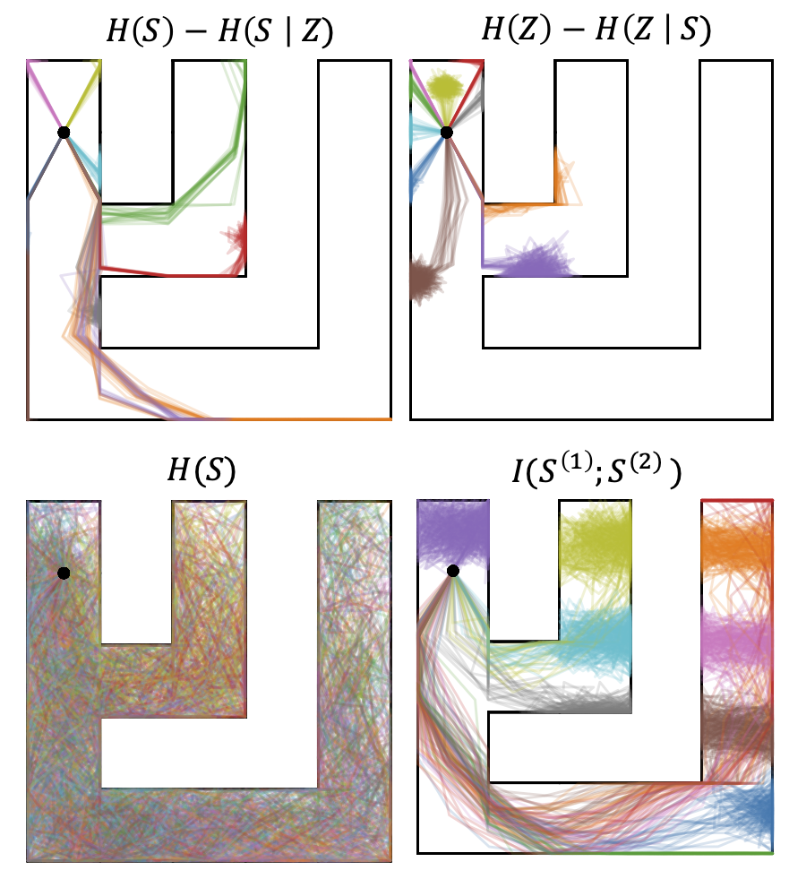
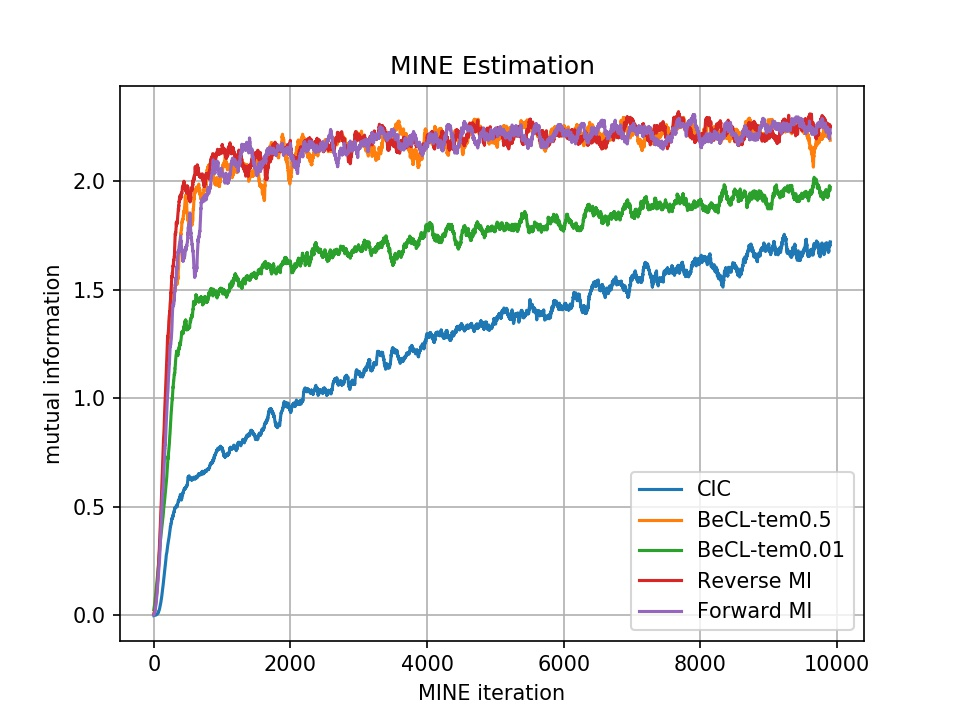
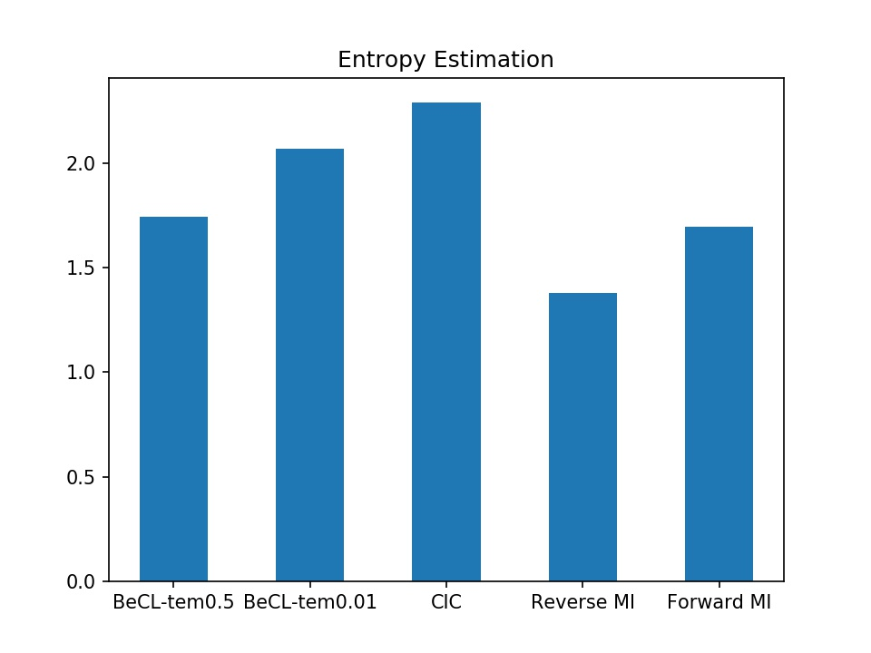
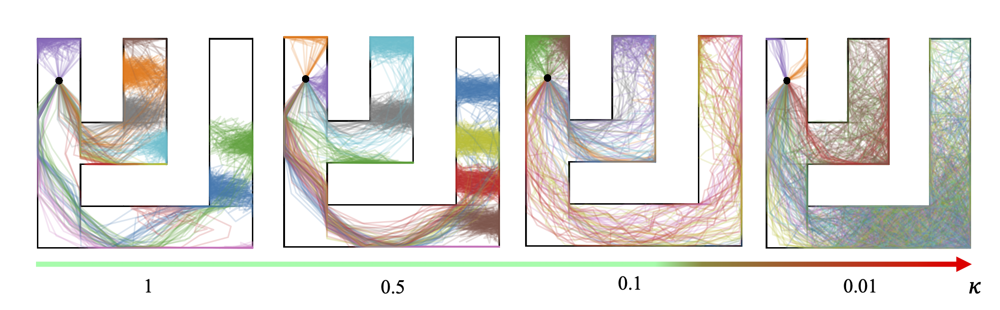

# Mutual Information and Entropy Estimation

## Training and Rollout

This code provides the Mutual Information (MI) and entropy estimation of BeCL and other baselines in Maze tasks. Experiments are run using Python 3.5.2 and the packages listed in `requirements.txt`.

We extend the EDL codebase from the paper [Explore, Discover and Learn: Unsupervised Discovery of State-Covering Skills](https://arxiv.org/abs/2002.03647). The type of experiment and algorithm is controlled by the settings provided in the config file (json).
Several example configuration files are provided in `examples/`. A directory corresponding to the name of the config file will be created inside of the log directory (second argument), and results will be stored there.

To run skill-discovery policies, we use the following command:

```
# Baseline: BeCL
python main.py --config-path examples/square_maze/contrastive_mi.json --log-dir logs/square_maze --dur 50 --N 1

# Baseline: CIC
python main.py --config-path examples/square_maze/cic_mi.json --log-dir logs/square_maze --dur 50 --N 1

# Baseline: Forward MI
python main.py --config-path examples/square_maze/forward_mi.json --log-dir logs/square_maze --dur 50 --N 1 

# Baseline: Reverse MI
python main.py --config-path examples/square_maze/reverse_mi.json --log-dir logs/square_maze --dur 50 --N 1 
```

We illustrate the rollout trajectories in the following.




## Mutual Information Estimation

We estimate the Mutual Information by following the methods proposed in [Mutual Information Neural Estimator (MINE). ICML 2018](http://proceedings.mlr.press/v80/belghazi18a/belghazi18a.pdf). After generating trajectories for each method, we train a score function to estimate the MI based on MINE principles. The code is given in `MINE.py`. 

To perform MINE estimation, we use the following command:

```
python MINE.py --algo cic_mi 
python MINE.py --algo contrastive_mi_0.5 
python MINE.py --algo contrastive_mi_0.01 
python MINE.py --algo reverse_mi
python MINE.py --algo forward_mi
```

The MINE estimation will be saved in `./MI-result`. When we set the temperature to `0.5` (the default setup in our paper), the MI estimation of BeCL is similar to previous forward and inverse MI-based algorithms, and outperforms the entropy-based methods like CIC. When we decrease the temperature, the MI also decreases. Since CIC only maximizes the state entropy, it makes the MI less than BeCL and different skills cannot be distinguished from each other. 

We show the comparison in the following figure. 




## Entropy Estimation

We adopt nonparametric particle-based entropy estimator used in [Behavior from the void: Unsupervised active pre-training. NeurIPS 2021] (https://proceedings.neurips.cc/paper/2021/hash/99bf3d153d4bf67d640051a1af322505-Abstract.html). The particle-based estimator measures the sparsity of the distribution by considering the distance between each sampled data point and its k nearest neighbors. The code is given in `Entropy.py`, and we show the comparison in the following figure. 



The result shows that CIC obtains the largest entropy since it directly maximizes the state-entropy. BeCL can balance the MI and entropy by choosing the suitable temperature. A small temperature leads to more uniformly distribution and increases the state-entropy, while it somewhat weakens the discriminability of skills. We show how the temperature affects the trajectory distribution in the following. 


